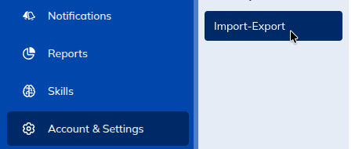
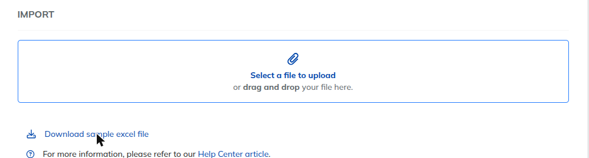
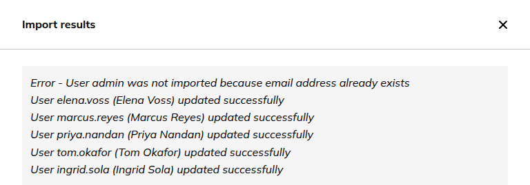

# TalentLMS bridge — Excel export

A Moodle admin tool that exports your site's users to an Excel file matching
[TalentLMS](https://www.talentlms.com/)'s own bulk-import "Users" template —
for a one-time move of your Moodle user base into TalentLMS, reviewed by an
admin before it's uploaded.

Frankenstyle component: `local_talentlms_bridge`.

## What it does

- **Site administration > Plugins > Local plugins > TalentLMS bridge**
  ("Export users to TalentLMS (Excel)") downloads every Moodle user as an
  `.xlsx` file, ready to upload in TalentLMS's own Account & Settings >
  Import-Export screen.
- Each user's TalentLMS **User-type** (SuperAdmin / Admin-Type / Trainer-Type
  / Learner-Type) is set automatically from their highest Moodle role.
- Any custom user profile fields defined on your site are included as
  extra columns, with a checkbox to leave specific ones out of a given
  export.
- Large sites can split the download into multiple files of 250 rows or
  fewer, matching TalentLMS's own recommendation for bulk imports — zipped
  together into a single download.
- **TalentLMS login overrides**: TalentLMS matches existing accounts by
  login. If someone already has a TalentLMS account under a different
  login than their Moodle username, a second admin page lets you record
  the real login so the export uses it instead.
- A short in-page walkthrough (with screenshots) covers finishing the
  import on the TalentLMS side.

## Screenshots

| Download the export | Upload in TalentLMS | Check the results |
| --- | --- | --- |
|  |  |  |

## Requirements

- Moodle 5.2 or later. (Only tested against 5.2 so far — see
  [`version.php`](version.php).)
- No API keys, SFTP server, or other TalentLMS-side setup required — this
  is a plain file download, uploaded by hand.

## Installation

1. Copy (or clone) this repository into `local/talentlms_bridge` in your
   Moodle installation (`<moodle>/local/talentlms_bridge` — or
   `<moodle>/public/local/talentlms_bridge` on Moodle 5.1+'s split webroot
   layout).
2. Visit **Site administration > Notifications** to complete the install.
3. Go to **Site administration > Plugins > Local plugins > TalentLMS
   bridge** to run an export.

## Capability

Both admin pages are gated by `local/talentlms_bridge:managesync`, granted
to the `manager` archetype by default — so a manager doesn't need full
`moodle/site:config` access to use them.

## Privacy

This plugin stores one row per Moodle user it has touched (currently: only
via the login-override page) in `local_talentlms_bridge_user`, recording
their TalentLMS login override. It implements Moodle's Privacy API
(`classes/privacy/provider.php`) so this data is included in Moodle's
standard data-export and data-deletion tools.

## License

GPL v3 or later — see [LICENSE](LICENSE).

## Issues

Found a bug or have a feature request? Please
[open an issue](https://github.com/pstamb/moodle-local_talentlms_bridge/issues).
